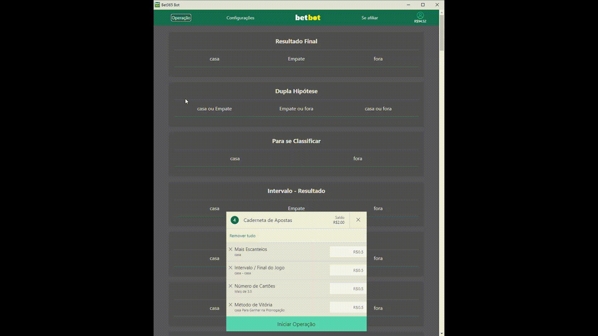

# BetBot


> Um automatizador de apostas para a plataforma Bet365. O objetivo foi de criar uma interface responsiva, mas que se comunique com o script python. 

## Tecnologias usadas
- Selenium para controle na Bet365.
- Eel para construção da interface
- MongoDB para armazenamento de usuários

## Dificuldades
A catalogação de cada tipo de botão além do acesso a plataforma de forma a não ser visto como bot. Além da preocupação estética para se parecer com a plataforma, sem esquecer dos efeitos visuais e interações, de forma a manter um padrão de qualidade para o usuário.

## Como utilizar
1. Certifique-se que tem uma conta na Bet, e pegue o seu nome de usuário e senha.
2. Certifique-se que tem o Firefox (ver o widgets.py) instalado com o seu respectivo Gecko Driver 
3. Crie uma conta no MongoDB, um Cluster para criar uma Database chamada betbpt (ver o database.py) com uma Collection chamada users
4. Adicione a seguinte linha no final do database.py:
```py
MongoDB.cadastrar("NOMEDOUSUARIO", "SENHA") # Nome do usuário da conta da Bet e sua senha
```
5. Inicie o bot e faça o login.


